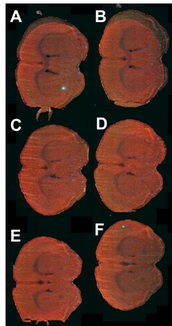

# Slide Stitching Exercise

## Background

A single slide containing four individual, stained mouse brain sections was imaged using a widefield scanner. The slide looks somthing like the following:



## Problem

The whole slide can't be imaged all at once.  Instead, a robot scanner produces smaller image tiles of this slide, each of constant height and width, saving all of them into one folder, regardless of which section they belong to. 

We want images of the brain sections.  How do we reconstruct the image for each section?

Create a program that:

  1) Copies or Symlinks the images into seperate folders, one for each brain section.  (e.g. data/proacessed/A, data/processed/B, etc)

    - The filenames contain metadata that will help with this.
    
    - Naming should happen consistently, with the first directory corresponding to the upper-left-most section, and proceeding left-to-right, top-to-bottom, ending with the lower-right-most section.

  2) Creates a merged section image file for a given section directory.


This program can take the form of a jupyter notebook, a function, or a command-line script.  It should be organized and easy to modify for other files.

## Get a clone of this repository on your computer

```
git clone <the url of this repository>
```

## Installing the Required Packages

```
pip install -r requirements
```

## Downloading the Data

```
dvc pull
```

  

## Contributors

Many thanks to Dr. Johannes Kohl (https://www.kohl-lab.org/people) for providing the data and description for this kata!